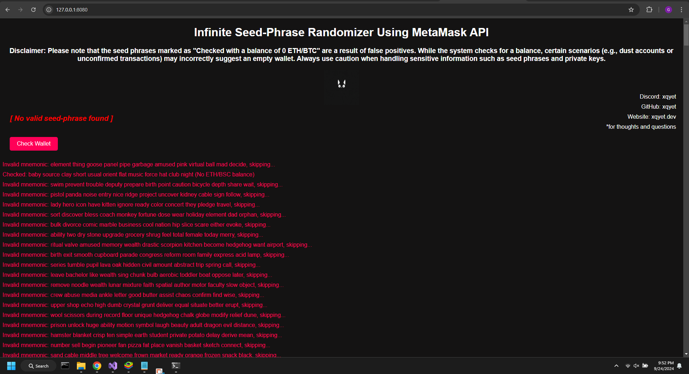
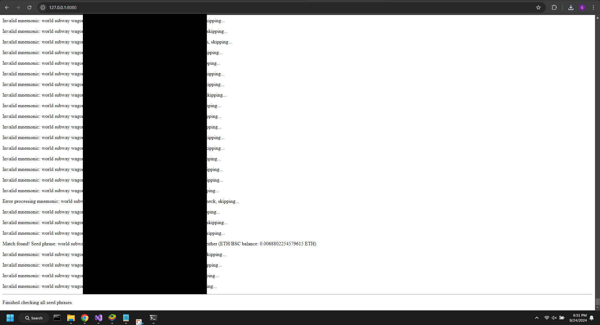

# Infinite Seed-Phrase Randomizer Using MetaMask API

### Overview:
This project is an infinite seed-phrase generator and checker for blockchain wallets using the MetaMask API. It continuously generates random 12-word BIP-39 seed phrases, validates them, and checks for wallet balances on Ethereum and Binance Smart Chain. If a valid seed phrase is found, the details are saved to a JSON file, and the top of the webpage will be updated. You have about a 100 trillion quadrillion chance of finding a wallet actually being used with real money inside! Preferably models like this can be used to recover funds for users that have partial memory of what their seed-phrase was. Large overhauls to the code may be needed depending on the scenario of course!

[front-end repo](https://github.com/xqyet/Infinite-Seed-Phrase-Randomizer_FRONTEND)

### What it do:
- **Infinite Seed-Phrase Generation**: Continuously generates random seed phrases.
- **Validation**: Validates each seed phrase using `ethers.js`.
- **Wallet Balance Check**: Checks for wallet balances (ETH/BSC).
- **Auto-Save**: Saves matching seed phrases with non-zero balance to a JSON file.
- **Web-page**: Displays current status of phrase checking, including errors and matches.
  

(in the above example it is generating around 2000 seed-phrases/s, extending the page downward infinitely for visualization)
### What it use:
- **MetaMask API**: For wallet interactions.
- **Ethers.js**: For seed phrase validation and wallet generation.
- **Web3.js**: For Ethereum and Binance Smart Chain balance checks.
- **Solana Web3.js**: For Solana integration.
- **BitcoinJS**: For Bitcoin integration.
- **ASP.NET Core API**: Backend API for generating seed phrases.

*example of wallet with funds being found (it's my own wallet using a limited search) *also yes I know you could use my own program to find my wallet address in 30 years :p

  
  
### Installation:

1. **Clone the repo**:
   ```bash
   git clone https://github.com/your-username/your-repo-name.git
   cd your-repo-name
   ```
### Install dependencies:

- **Backend**: Run the project in Visual Studio (ASP.NET Core).
- **Frontend**: Serve `index.html` in a browser. My backend and Frontend were two different VS projects, Backend (ASP.NET Core Web API Project) and Frontend (Static Website or HTML Project).
  - Use your local server
  ```bash
   npm install -g http-server
   ```
  
### Run the backend API:

1. Make sure your backend is running at `http://localhost:5233`. for example
2. run `http-server .` in your console to see the webpage.

### How it works:

1. Press **Check Wallet** to start checking random seed phrases.
2. The app checks each phrase and displays results in real-time.
3. If a matching seed phrase with a balance is found, it is saved as a JSON file in the browser. The red message at the top of the web-page will also update to a bright green "seed-phrase found".


### Disclaimer:

This was just a fun project I made using many of the same techniques used to recover soft-wallets that have partial seed-phrase recovery. If you are interested in my front-end framework, I linked to it above! However you'd probably like to make your own front-end (webpage or console based, doesn't matter) it's open source so fork and do whatever you want, but please don't abuse it for bad stuff.
  


